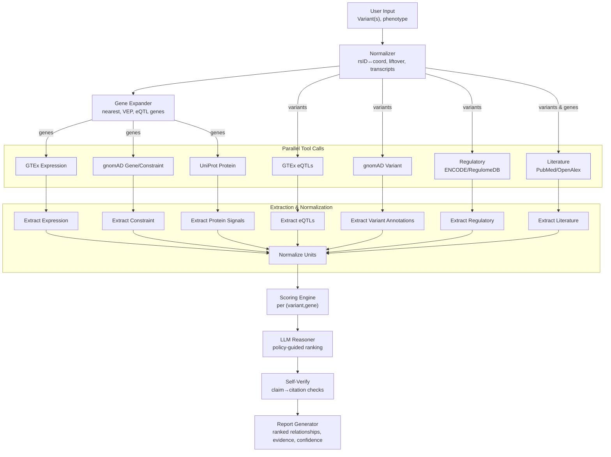

## Table of Contents

- [Part 1: Variant to Gene Annotation Tool](#part-1-variant-to-gene-annotation-tool)
  - [App Demo](#app-demo)
  - [App Link](#app-link)
  - [Features](#features)
  - [Requirements](#requirements)
  - [Installation](#installation)
    - [Install uv (if not already installed)](#install-uv-if-not-already-installed)
    - [Install Project Dependencies](#install-project-dependencies)
  - [Usage](#usage)
  - [Features Overview](#features-overview)
    - [1. Overview Tab](#1-overview-tab)
    - [2. Validation Tab](#2-validation-tab)
    - [3. Annotation Tab](#3-annotation-tab)
    - [4. Summary Tab](#4-summary-tab)
  - [Input Format](#input-format)
  - [Result Output](#result-output)
    - [Annotated Variants CSV (result/annotated\_variants.csv)](#annotated-variants-csv-resultannotated_variantscsv)
    - [Summary JSON (result/variant\_summary.json)](#summary-json-resultvariant_summaryjson)
  - [API Information](#api-information)
  - [Dependencies](#dependencies)
- [Part 2: AI/ML and Agentic Workflow Design](#part-2-aiml-and-agentic-workflow-design)
  - [Goal](#goal)
  - [Overview](#overview)
  - [Design Rationale (Why these choices)](#design-rationale-why-these-choices)
  - [Orchestration (pseudocode)](#orchestration-pseudocode)
  - [Reasoning Chain (Decision Policy)](#reasoning-chain-decision-policy)
  - [Accuracy, Confidence, and Self-Verification](#accuracy-confidence-and-self-verification)
  - [Failure Modes and Mitigations](#failure-modes-and-mitigations)
  - [Extensibility](#extensibility)
  - [Mermaid Architecture Diagram](#mermaid-architecture-diagram)
  - [Example Report Skeleton (LLM Output)](#example-report-skeleton-llm-output)
  - [Implementation Notes](#implementation-notes)
- [Part 3: Scientific Reasoning \& Communication](#part-3-scientific-reasoning--communication)
  - [Scenario](#scenario)
  - [1. Validation plan: computational and experimental](#1-validation-plan-computational-and-experimental)
    - [Computational validation](#computational-validation)
    - [Experimental validation](#experimental-validation)
  - [2. How an AI agent can assist interpretation and prioritization](#2-how-an-ai-agent-can-assist-interpretation-and-prioritization)
  - [3. One key limitation of AI agents for biological reasoning](#3-one-key-limitation-of-ai-agents-for-biological-reasoning)
  - [Takeaway](#takeaway)

# Part 1: Variant to Gene Annotation Tool

A Streamlit web application for analyzing genetic variants (SNPs) and annotating them with their nearest genes using the Ensembl REST API. The tool provides comprehensive validation, annotation, and statistical analysis of variant data.

## App Demo

https://github.com/user-attachments/assets/274b0e54-bc50-4ebd-bf7a-a2c6fa84150f

## App Link

[Variant to Gene Annotation Tool](https://variant-to-gene.streamlit.app/)

## Features

- **Data Validation**: Automatically identifies duplicated and malformed variant entries
- **Gene Annotation**: Annotates variants with nearest genes using Ensembl REST API
- **Interactive Dashboard**: Multi-tab interface with data overview, validation, annotation, and summary statistics
- **Visualizations**: Interactive charts showing chromosome distribution and top genes
- **Data Export**: Download annotated variants as CSV and summary statistics as JSON
- **Filtering & Search**: Filter annotated results by chromosome, gene annotation status, and variant ID

## Requirements

- Python >= 3.12
- `uv` package manager (optional, but recommended)
- Internet connection (for Ensembl REST API access)

## Installation

### Install uv (if not already installed)

```bash
curl -LsSf https://astral.sh/uv/install.sh | sh

echo 'export PATH="$HOME/.local/bin:$PATH"' >> ~/.zshrc

source ~/.zshrc
```

### Install Project Dependencies

This project uses `uv` for package management. Install dependencies with:

```bash
uv sync
```

Alternatively, if you prefer using `pip`:

```bash
pip install -r requirements.txt
```

## Usage

Run the Streamlit app with `uv`:

```bash
uv run streamlit run app.py
```

Or if dependencies are installed globally:

```bash
streamlit run app.py
```

The application will start and open in your default web browser at `http://localhost:8501`.

## Features Overview

### 1. Overview Tab
- Displays total variants, unique variants, chromosomes, and unique positions
- Shows raw data preview
- Interactive chromosome distribution chart

### 2. Validation Tab
- Identifies duplicate variant entries
- Detects malformed entries (invalid chromosomes, positions, or nucleotide codes)
- Provides data quality summary with quality score

### 3. Annotation Tab
- Processes variants and annotates with nearest genes
- Shows progress bar during annotation
- Interactive filtering options:
  - Filter by chromosome
  - Filter by gene annotation status (All/With Gene/Without Gene)
  - Search by variant ID
- Displays annotated results in a searchable, filterable table

### 4. Summary Tab
- Overall statistics (total variants, annotation rates)
- Chromosome distribution visualization and table
- Top 10 genes with most variants (with visualization)
- Download options for annotated CSV and summary JSON

## Input Format

The application expects a CSV file with the following columns:

- `variant_id`: Unique identifier for the variant (e.g., rs72809442)
- `chrom`: Chromosome number (1-22, X, Y, or MT)
- `pos`: Position on chromosome (positive integer)
- `ref`: Reference nucleotide (A, T, G, or C)
- `alt`: Alternate nucleotide (A, T, G, or C)

Example:
```csv
variant_id,chrom,pos,ref,alt
rs72809442,10,75603627,G,A
rs778943,4,62379653,C,T
```

Currently, the application loads `sample_variants.csv` by default. To use a different file, modify the `file_path` variable in `app.py` (line 231).

## Result Output

### Annotated Variants CSV (result/annotated_variants.csv)
The annotated CSV includes all original columns plus:
- `nearest_gene_id`: Ensembl gene ID
- `nearest_gene_name`: Gene symbol/name
- `distance_to_gene`: Distance in base pairs to nearest gene
- `gene_strand`: Strand orientation (+1 or -1)

### Summary JSON (result/variant_summary.json)
Includes:
- `chromosome_counts`: Number of variants per chromosome
- `top_10_genes`: Top 10 genes with most variants
- `total_variants`: Total number of variants processed
- `variants_with_gene_annotation`: Count of successfully annotated variants
- `variants_without_gene_annotation`: Count of variants without gene annotation

## API Information

The application uses the [Ensembl REST API](https://rest.ensembl.org/) to retrieve gene information. Specifically:
- Endpoint: `/overlap/region/human/{chromosome}:{start}-{end}`
- Feature: Gene overlaps within a 50kb window around each variant
- The application respects API rate limits with a 0.1-second delay between requests

## Dependencies

- **streamlit** >= 1.28.0: Web framework for the application
- **pandas** >= 2.0.0: Data manipulation and analysis
- **requests** >= 2.31.0: HTTP library for API calls
- **plotly** >= 5.17.0: Interactive visualizations

# Part 2: AI/ML and Agentic Workflow Design

## Goal
Design an AI Agent to automatically summarize variant-to-gene relationships from open data sources (e.g., GTEx, gnomAD, UniProt) and produce a concise, human-readable report with evidence and confidence.

## Overview
- **Inputs**: Variant(s) (e.g., chr:pos:ref:alt, rsID), optional phenotype/context.
- **Tools/APIs**: GTEx (expression, eQTLs), gnomAD (frequency, constraint, variant annotations), UniProt (protein function/domains), Ensembl/NCBI (mapping, transcripts), RegulomeDB/ENCODE (regulatory evidence), OpenAI API or LangGraph/CrewAI for orchestration.
- **Outputs**: Ranked variant→gene relationships, each with evidence snippets, normalized scores, and a short synthesis paragraph.

## Design Rationale (Why these choices)
- **Start with rigorous normalization**: Variant mapping and build-aware liftover prevent downstream evidence mismatches; biology results are only as good as coordinate fidelity.
- **Parallelize evidence retrieval**: Biological evidence is multi-modal and independent (expression, constraint, protein domains, regulation). Parallel tool-calls reduce latency without coupling signals.
- **Evidence fusion, not single-source**: No single dataset decides causality; combining eQTLs, regulatory signals, and coding impact reflects real biological causation pathways.
- **Tissue/context awareness**: Many gene effects are tissue-specific; selecting tissues by phenotype aligns AI reasoning with biological relevance.
- **Scoring before LLM synthesis**: A numeric, interpretable layer grounds the LLM, constraining free-form text and reducing hallucinations.
- **Self-verification with citations**: Requiring source-backed claims mirrors scientific practice and increases user trust.
- **Abstention over overreach**: Returning “insufficient evidence” is preferable to speculative biology; this keeps outputs decision-grade.
- **Modular architecture**: Swappable tools (LangGraph, CrewAI) and pluggable APIs future-proof the pipeline as datasets evolve.

## Orchestration (pseudocode)
This sequence mirrors biological inference (variant→gene→function) while leveraging AI orchestration for retrieval, synthesis, and verification.
```python
# High-level, framework-agnostic pseudocode (adaptable to LangGraph, CrewAI, Autogen)

def run_pipeline(variant_queries, phenotype=None):
    context = initialize_context(variant_queries, phenotype)

    # 1) Normalize & map variants
    normalized = map_variants(variant_queries)  # rsID ↔ genomic coords, build liftover, transcript context
    candidate_genes = expand_genes(normalized)  # nearest genes, eQTL genes, VEP consequence genes

    # 2) Parallel evidence gathering (tool-calls)
    evidence = parallel({
        'gtex_expression': lambda: fetch_gtex_expression(candidate_genes, tissues=select_tissues(phenotype)),
        'gtex_eqtls': lambda: fetch_gtex_eqtls(normalized, tissues=select_tissues(phenotype)),
        'gnomad_variant': lambda: fetch_gnomad_variant(normalized),
        'gnomad_gene': lambda: fetch_gnomad_gene(candidate_genes),
        'uniprot': lambda: fetch_uniprot(candidate_genes),
        'regulatory': lambda: fetch_regulatory_evidence(normalized),
        'literature': lambda: retrieve_literature(normalized, candidate_genes, phenotype)
    })

    # 3) Evidence extraction & normalization
    extracted = {
        'expression': extract_expression(evidence['gtex_expression']),           # tissue specificity, effect sizes
        'eqtl': extract_eqtls(evidence['gtex_eqtls']),                          # p-values, colocalization hints
        'variant': extract_variant_annotations(evidence['gnomad_variant']),     # consequence, freq, pathogenic flags
        'constraint': extract_constraint(evidence['gnomad_gene']),              # LOEUF, pLI
        'protein': extract_protein(evidence['uniprot']),                        # domains, function, GO terms
        'regulatory': extract_regulatory(evidence['regulatory']),               # TFBS, chromatin marks
        'literature': extract_lit_claims(evidence['literature'])                # key claims + citations
    }
    normalized_evidence = normalize_units(extracted)

    # 4) Scoring & aggregation (per variant→gene pair)
    scores = {}
    for v in normalized:
        for g in candidate_genes[v]:
            scores[(v,g)] = score_pair(
                expression=normalized_evidence['expression'].get(g),
                eqtl=normalized_evidence['eqtl'].get((v,g)),
                variant=normalized_evidence['variant'].get(v),
                constraint=normalized_evidence['constraint'].get(g),
                protein=normalized_evidence['protein'].get(g),
                regulatory=normalized_evidence['regulatory'].get((v,g)),
                literature=normalized_evidence['literature'].get((v,g))
            )

    # 5) LLM-guided reasoning with tool grounding
    ranked = llm_reason_and_rank(
        variant_list=normalized,
        candidate_genes=candidate_genes,
        scores=scores,
        evidence=normalized_evidence,
        policy=reasoning_policy()
    )

    # 6) Self-checking & verification
    verified = self_verify_and_recall_check(ranked, evidence_sources=evidence)

    # 7) Report generation
    return generate_report(verified, format='markdown', audience='expert')
```

## Reasoning Chain (Decision Policy)
- **Grounding-first**: Prefer direct mechanistic links (e.g., coding consequence in a constrained gene, strong eQTL colocalizing with GWAS signal) over weak correlations.
- **Multi-criterion fusion**: Combine independent evidence channels: gene expression relevance, eQTL significance, regulatory plausibility, protein domain impact, population frequency/constraint, and literature consensus.
- **Parsimony**: If multiple genes are plausible, prioritize the one with higher total score and fewer unsupported leaps.
- **Conflict handling**: If signals disagree (e.g., benign population frequency but severe in-silico impact), surface as uncertainty and lower confidence.
- **Abstention**: If evidence falls below threshold, return “insufficient evidence” instead of over-claiming.

## Accuracy, Confidence, and Self-Verification
Why: Biological claims must be reproducible and source-grounded; these safeguards calibrate confidence and constrain the LLM to verifiable evidence.
- **Evidence scoring**: Weighted components per pair (v,g):
  - eQTL p-value/effect size (tissue-matched) → strong weight
  - Colocalization or LD with trait signal → strong weight (if available)
  - Variant consequence severity (VEP), domain criticality (UniProt) → moderate-strong
  - Gene constraint (LOEUF/pLI) → moderate
  - Expression specificity in relevant tissue → moderate
  - Regulatory overlap (TFBS, chromatin) with matched cell-type → moderate
  - Literature consensus and recency → variable weight with citation count/quality
- **Calibration**: Map total score to confidence bands (e.g., High/Moderate/Low) using held-out benchmark sets.
- **Self-check loop**: A second LLM pass verifies each claim against quoted sources; any claim lacking a citation is removed or marked low confidence.
- **Tool-grounded citations**: Each bullet in the report includes the API source, identifiers, and hyperlinks.
- **Deterministic safeguards**: Numeric p-values, allele frequencies, and coordinates are copied verbatim from sources with minimal formatting.

## Failure Modes and Mitigations
- Missing or rate-limited APIs → cache layer with exponential backoff and retries; degrade gracefully.
- Build mismatches (GRCh37 vs GRCh38) → explicit liftover with checksum validation.
- Ambiguous rsID mapping → collect multiple records, disambiguate via coordinates and alleles.
- Hallucination risk → require that any synthesized statement is backed by extracted evidence tokens; no-evidence → no claim.

## Extensibility
- Plug additional tools: Ensembl VEP, ClinVar, OMIM, OpenTargets Genetics, colocalization tools.
- Swap orchestrator: LangGraph state machine, CrewAI multi-agent (Fetcher, Extractor, Judge, Writer), or single-agent with function-calling.

## Mermaid Architecture Diagram


## Example Report Skeleton (LLM Output)
```markdown
# Variant-to-Gene Summary

## Variant: rsXXXX (chr:pos ref>alt)
- Most likely gene: GENE1 — High confidence
  - eQTL: significant in heart left ventricle (p=3e-10) [GTEx v8]
  - Protein/domain: missense in kinase domain [UniProt QXXXX]
  - Constraint: LOEUF=0.25 (high constraint) [gnomAD]
  - Literature: 3 supporting studies (PMIDs: 123, 456, 789)

## Alternatives
- GENE2 — Moderate: regulatory overlap but weak expression match.

Notes: Coordinates and statistics verbatim from cited sources. Confidence bands calibrated on internal benchmark.
```

## Implementation Notes
- A practical implementation can use LangGraph for explicit state and tool nodes, with an OpenAI function-calling model as the Reasoner and a separate Verifier model for self-checking.
- Caching and idempotency are critical for reproducibility; persist raw API JSON, parsed evidence, and final reports.


# Part 3: Scientific Reasoning & Communication

## Scenario
A variant associated with Hypertrophic Cardiomyopathy (HCM) — for example, `rs34357398` — colocalizes with regulatory signals linked to `MYBPC3` across multiple cardiac tissues.

## 1. Validation plan: computational and experimental

### Computational validation
- **Replicate colocalization across datasets**: Re-run colocalization (e.g., coloc, eCAVIAR, fastENLOC) using independent eQTL/caQTL/ sQTL resources (GTEx v8 heart atrial appendage/left ventricle, eQTLGen, cardiomyocyte-specific QTLs) and the same GWAS. Consistent posterior probabilities (e.g., coloc PP4 > 0.7) strengthen confidence.
- **Fine-map both traits**: Use finemapping (FINEMAP, SuSiE) to compute credible sets for the GWAS locus and the molecular QTL; evaluate overlap of 95% credible variants. Prioritize variants with high PIP and regulatory annotations in cardiomyocytes.
- **LD and conditional analyses**: Confirm the signal is not explained by nearby variants with high LD. Perform conditional/stepwise analyses (GCTA-COJO, regenie conditional) to test whether the eQTL and GWAS effects persist when conditioning on lead variants.
- **Functional priors via annotation integration**: Integrate cardiomyocyte-relevant chromatin (ATAC-seq, H3K27ac), TF motifs (GATA4, MEF2, TBX5), promoter–enhancer maps (Hi-C/HiChIP/Capture-C), and conservation to compute regulatory priors (TORUS/PAINTOR). Increased prior weight in `MYBPC3` enhancers supports causality.
- **Directionality and dose–response**: Check that the risk allele directionally associates with `MYBPC3` expression (e.g., risk allele → decreased `MYBPC3` if haploinsufficiency is pathogenic). Assess effect sizes across tissues/cell types to ensure a cardiac-specific pattern.
- **Allele-specific signals**: Test allele-specific chromatin accessibility or expression in relevant datasets (ASE in RNA-seq; allelic imbalance in ATAC-seq). Consistent allelic imbalance indicates cis-regulatory impact.
- **Network-level consistency**: Evaluate whether samples stratified by genotype show coherent changes in sarcomere-related pathways and co-expression modules where `MYBPC3` is central.

Why these steps: They jointly assess robustness (replication), specificity (cardiac context), causality plausibility (fine-mapping with functional priors), and mechanism (directionality and allele-specificity), reducing the chance of confounding by LD or data idiosyncrasies.

### Experimental validation
- **Reporter or MPRA**: Test reference vs. alternate alleles of the candidate enhancer in cardiomyocyte contexts (hiPSC-CMs; cardiac-like lines). Expect allele-dependent transcriptional output.
- **CRISPR perturbation of the element**: Use CRISPRi/a or small deletions to modulate the putative enhancer harboring `rs34357398` in hiPSC-CMs; quantify `MYBPC3` expression by qPCR/RNA-seq. If the site is causal, perturbation should change `MYBPC3` levels in line with risk allele direction.
- **Base editing/prime editing**: Edit the endogenous locus to swap the allele without changing the broader chromatin context; measure `MYBPC3` expression and downstream phenotypes.
- **Chromatin conformation**: Apply promoter-capture Hi-C or HiChIP (H3K27ac) to test physical contacts between the variant-containing enhancer and the `MYBPC3` promoter in cardiomyocytes.
- **Phenotypic readouts**: In edited hiPSC-CMs, assess sarcomere organization, contractility, calcium handling, and hypertrophy markers. Partial recapitulation of HCM-relevant phenotypes strengthens causal inference.

Why these steps: They move from sequence-level effects (MPRA) to endogenous regulation (CRISPR), to gene expression and cardiomyocyte function, providing convergent mechanistic evidence.

---

## 2. How an AI agent can assist interpretation and prioritization
- **Evidence aggregation and provenance tracking**: Automatically pull GWAS, eQTL/caQTL, fine-mapping PIPs, LD structure, chromatin marks, TF motif disruptions, and 3D contacts; present a scored, explainable summary with links to primary sources.
- **Mechanistic hypothesis generation**: Propose plausible regulatory mechanisms (e.g., allele disrupts MEF2 motif in a left-ventricle enhancer contacting `MYBPC3`), grounded in motif and epigenomic overlaps.
- **Uncertainty-aware prioritization**: Combine statistical evidence (coloc PP4, PIP), functional priors, tissue specificity, and directionality into a transparent multi-criteria score; surface what drives the rank and where evidence is weak.
- **Experiment design suggestions**: Recommend context-appropriate assays (CRISPRi vs. base editing), controls, sample sizes, and effect-size expectations; generate analysis-ready code notebooks (QC, coloc, finemapping, differential expression).
- **Literature triage and contradiction detection**: Summarize relevant `MYBPC3`/HCM papers, flag conflicting reports, and reconcile differences; suggest keywords or datasets to resolve disagreements.

Why this helps: It accelerates synthesis across heterogeneous datasets, keeps provenance explicit, and focuses researcher attention on the highest-yield follow-ups while revealing evidence gaps.

---

## 3. One key limitation of AI agents for biological reasoning
**Hallucination and overconfident synthesis**: Large language model agents can fabricate relationships or overstate weak associations when integrating sparse, heterogeneous data. In biology—where causality depends on nuanced context (cell type, developmental stage, assay biases)—these errors can misdirect experiments and inflate confidence.

Mitigations:
- Enforce strict grounding to curated sources with citations and data snapshots; require explicit uncertainty estimates.
- Separate data retrieval from reasoning; verify numerical claims with programmatic checks.
- Keep a human-in-the-loop for adjudicating conflicting evidence and setting priors.

Why this matters: Reliable biological conclusions require transparent evidence and calibrated uncertainty; without safeguards, AI can produce compelling but incorrect narratives.

---

## Takeaway
The most credible validation marries reproducible statistical colocalization and finemapping with cardiomyocyte-centric functional assays that test directionality and mechanism. AI agents are powerful for integrating evidence and proposing next steps, provided they are constrained by provenance, uncertainty quantification, and human supervision.


